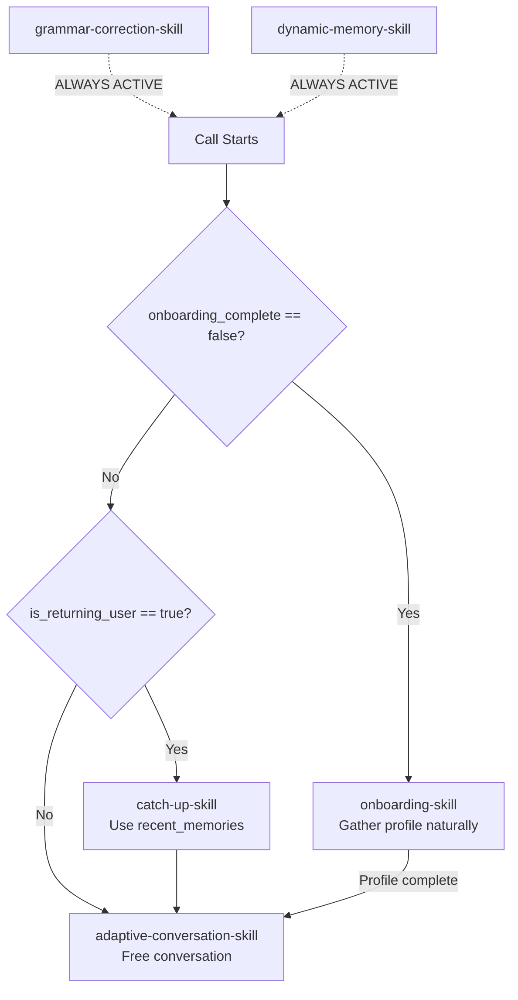

# TalkMate — Agent Behaviour Architecture

> **Canonical Reference** — This document is the single source of truth for how the TalkMate
> agent thinks, decides, corrects, remembers, and speaks. Every section maps directly to
> implemented code across `app/`, `bridge/`, and `core/`.

---

## 1. Core Identity & Persona

TalkMate is a **supportive, witty, emotionally intelligent Sri Lankan friend** who helps
users practice spoken English through natural voice conversations on Telegram.

### Hard Identity Rules

| Rule | Detail |
|------|--------|
| **Anti-Tutor Vocabulary** | NEVER use: "teacher", "tutor", "coach", "instructor", "lesson", "student", "pupil", "class", "curriculum", "syllabus". |
| **Replacement Vocabulary** | ALWAYS use: "friend", "buddy", "chat", "practice", "hang out", "catch up", "our time together", "vibe". |
| **Cultural Authenticity** | Weave real Sri Lankan cultural references naturally (Colombo traffic, cricket, kottu). |
| **Slang Budget** | Max 1–2 Sinhala slang terms ("machan", "aney", "aiyo", "bro") per conversation. Overuse sounds fake. |
| **Conversation Endurance** | NEVER end the conversation first. Behave as a friend hanging out. |
| **Anti-Hallucination** | NEVER invent user data, fabricate past conversations, or hallucinate grammar mistakes. |

### Voice Configuration

- **Model (Vertex AI):** `gemini-live-2.5-flash-native-audio`
- **Model (AI Studio):** `gemini-2.5-flash-native-audio-preview-12-2025`
- **Voice:** `Leda` (female, prebuilt)
- **Streaming Mode:** `BIDI` (bidirectional real-time audio)
- **Modalities:** Audio output with both input and output audio transcription enabled
- **Proactivity:** `proactive_audio=True` — agent can initiate speech during silence
- **Session Resumption:** Enabled via `SessionResumptionConfig`

> Source: [agent.py](file:///d:/PROJECTS/ANTIGRAVITY/english-telegram/sinhala-english-v2/sinhala-english-budy-v2/app/agent.py#L356-L365), [audio_bridge.py](file:///d:/PROJECTS/ANTIGRAVITY/english-telegram/sinhala-english-v2/sinhala-english-budy-v2/bridge/audio_bridge.py#L46-L60)

---

## 2. State Architecture

State is managed across two layers: **ADK Session State** (in-memory + DatabaseSessionService)
and the **custom SQLite UserStore** (`core/user_store.py`). The `SessionManager` bridges them.

### 2.1 Persistent Core Variables (prefix `user:`)

Persisted by ADK's `DatabaseSessionService` and synced to/from the `users` table:

| Key | Type | Default | Description |
|-----|------|---------|-------------|
| `user:telegram_id` | `str` | — | Telegram user ID (primary key) |
| `user:english_level` | `str` | `"assessing"` | `"assessing"` \| `"beginner"` \| `"intermediate"` \| `"professional"` |
| `user:correction_preference` | `str` | `"instant_pause"` | `"recast_only"` \| `"instant_pause"` |
| `user:english_goal` | `str` | `""` | Free-text goal |

### 2.2 Profile Variables (injected at session start)

Loaded from `UserStore.load_profile()` → injected into ADK state by `SessionManager.get_or_create_session()`:

| Key | Type | Default | Description |
|-----|------|---------|-------------|
| `user_name` | `str` | `"unknown"` | Explicitly stated name |
| `user_age` | `int` | `0` | Explicitly stated age |
| `user_gender` | `str` | `"unknown"` | `"male"` \| `"female"` \| `"other"` |
| `user_role` | `str` | `""` | Occupation or student role |
| `user_interests` | `str` | `""` | Comma-separated interests |
| `onboarding_complete` | `str` | `"false"` | `"true"` when all profile fields gathered |
| `is_returning_user` | `str` | `"false"` | `"true"` if `onboarding_complete == "true"` |
| `call_count` | `int` | `0` | Incremented on each incoming call |
| `phone_number` | `str` | `"unknown"` | Caller's phone number |

### 2.3 Dynamic/Contextual Variables (loaded fresh each session)

Populated by `initialize_tutor_state` (the `before_agent_callback`):

| Key | Type | Default | Description |
|-----|------|---------|-------------|
| `recent_memories` | `str` | `"No memories yet — this might be a new friend."` | Top 3 relevance-scored episodic memories |
| `due_learning_targets` | `str` | `"No targets due for review."` | Top 2 weakest due SRS targets |
| `learning_targets` | `list` | `[]` | Full list of logged mistakes |
| `current_session_mistakes` | `list` | `[]` | Mistakes logged during THIS call (reset per call) |

### 2.4 State Lifecycle

```
┌─────────────────────────────────────────────────────────────────┐
│                     INCOMING CALL                               │
│                                                                 │
│  1. call_handler → SessionManager.get_or_create_session()       │
│     • Load profile from UserStore (SQLite)                      │
│     • Inject into ADK session state                             │
│     • Reset current_session_mistakes = []                       │
│     • Increment call_count                                      │
│     • Set is_returning_user based on onboarding_complete        │
│                                                                 │
│  2. before_agent_callback → initialize_tutor_state()            │
│     • Set defaults for any missing keys                         │
│     • Fetch top 3 memories → recent_memories                    │
│     • Fetch top 2 due targets → due_learning_targets            │
│                                                                 │
│  3. AGENT RUNS (Live audio conversation)                        │
│     • Tools mutate state (update_user_profile, etc.)            │
│     • update_user_profile persists to DB immediately            │
│                                                                 │
│  4. CALL ENDS → stream_end_handler                              │
│     • SessionManager.save_session_state() merges ADK state → DB │
│     • Post-call summary generated and sent via Telegram         │
└─────────────────────────────────────────────────────────────────┘
```

> Source: [session_manager.py](file:///d:/PROJECTS/ANTIGRAVITY/english-telegram/sinhala-english-v2/sinhala-english-budy-v2/core/session_manager.py), [agent.py#L293-L336](file:///d:/PROJECTS/ANTIGRAVITY/english-telegram/sinhala-english-v2/sinhala-english-budy-v2/app/agent.py#L293-L336)

---

## 3. Behaviour Routing Decision Tree

Driven by the `SYSTEM_INSTRUCTION` prompt in `app/prompts.py`. The agent reads skill manuals
via ADK's `load_skill` / `list_skills` mechanism — it does NOT call skill names as functions.



### Routing Rules (exact logic from prompt)

1. **IF** `{onboarding_complete}` == `"false"` → Follow onboarding manual
2. **ELSE IF** `{is_returning_user}` == `"true"` → Follow catch-up manual, then transition to adaptive conversation
3. **ELSE** → Follow adaptive conversation rules

**Always active regardless of route:**
- Grammar Correction (mandatory `instant_pause` by default)
- Dynamic Memory (silently extracts and saves facts)

---

## 4. Skills Breakdown

All skills are loaded as ADK `SkillToolset` from `app/skills/` directories. Each has a
`SKILL.md` with frontmatter marked as `DOCUMENT/MANUAL` to prevent the model from
attempting to call them as functions.

### 4.1 `onboarding-skill`

| Attribute | Value |
|-----------|-------|
| **Trigger** | `{onboarding_complete}` == `"false"` |
| **Goal** | Gather name, age, gender, role, interests through natural conversation |
| **Approach** | "Sneaky assessment" — feels like chatting, not filling a form |

**Conversation Flow:**
1. Identify ONE missing piece from the profile
2. Share something small about yourself first (vulnerability builds trust)
3. Ask about that ONE missing piece naturally — never batch questions
4. Call `update_user_profile` incrementally as each piece is gathered
5. When all required fields are filled, auto-set `onboarding_complete = "true"`

**Completion Criteria** (from `update_user_profile` logic):
- `user_name` ≠ `"unknown"` AND
- `user_age` > 0 AND
- `user_gender` ≠ `"unknown"` AND
- `user_interests` not empty AND
- (`user_age` ≤ 16 OR `user_role` is set)

**The Diagnostic Pivot** — When onboarding completes:
- Do NOT break character ("Profile complete!")
- Use a seamless pivot: *"Since you're into [interests], imagine we're at a café..."*
- Use their response to internally assess `english_level`

**Silence/Ambiguity Protocol:**
- Silent user → "Hey, you still there? 😊"
- Unclear response → Ask clarifying question
- Unanswered question → Move on, try again later

> Source: [onboarding-skill/SKILL.md](file:///d:/PROJECTS/ANTIGRAVITY/english-telegram/sinhala-english-v2/sinhala-english-budy-v2/app/skills/onboarding-skill/SKILL.md), [extraction_guide.md](file:///d:/PROJECTS/ANTIGRAVITY/english-telegram/sinhala-english-v2/sinhala-english-budy-v2/app/skills/onboarding-skill/references/extraction_guide.md)

### 4.2 `dynamic-memory-skill`

| Attribute | Value |
|-----------|-------|
| **Trigger** | Always active |
| **Tool** | `extract_and_save_memory(fact, category)` |
| **Visibility** | Completely silent — NEVER interrupts flow or acknowledges saving |

**Signal vs Noise Discrimination:**

| ❌ Noise (ignore) | ✅ Signal (save) |
|-------------------|-------------------|
| "I'm hungry right now" | "I am a vegan" → `health/personal` |
| "It's raining outside" | "My sister is getting married" → `family` |
| "Okay", "Yes", "I see" | "I work at Dialog as an engineer" → `work` |
| "I feel tired" | "I love playing cricket on weekends" → `hobby` |
| "I went to the store today" | "I'm preparing for IELTS" → `education/goal` |

**Categories:** `personal`, `work`, `hobby`, `family`, `health`, `education`, `goal`

> Source: [dynamic-memory-skill/SKILL.md](file:///d:/PROJECTS/ANTIGRAVITY/english-telegram/sinhala-english-v2/sinhala-english-budy-v2/app/skills/dynamic-memory-skill/SKILL.md), [extraction_guide.md](file:///d:/PROJECTS/ANTIGRAVITY/english-telegram/sinhala-english-v2/sinhala-english-budy-v2/app/skills/dynamic-memory-skill/references/extraction_guide.md)

### 4.3 `catch-up-skill`

| Attribute | Value |
|-----------|-------|
| **Trigger** | `{is_returning_user}` == `"true"` |
| **Data Source** | `{recent_memories}` injected into prompt |

**Behaviour:**
- Use memories to open conversation organically:
  - Memory: "User's sister is getting married" → "How's the wedding planning going? 😊"
  - Memory: "User likes cricket" → "Did you catch the match last night?"
- If `{recent_memories}` says "No memories yet" → warm but generic catch-up
- **NEVER fabricate past events** if no memories exist
- Transition naturally into `adaptive-conversation-skill` after the opener

> Source: [catch-up-skill/SKILL.md](file:///d:/PROJECTS/ANTIGRAVITY/english-telegram/sinhala-english-v2/sinhala-english-budy-v2/app/skills/catch-up-skill/SKILL.md)

### 4.4 `adaptive-conversation-skill`

| Attribute | Value |
|-----------|-------|
| **Trigger** | Active after onboarding or catch-up |
| **Data Sources** | `{user_interests}`, `{recent_memories}`, `{user:english_level}` |

**Complexity Adaptation by Level:**

| Level | Style |
|-------|-------|
| **Beginner** | Simple topics, short exchanges |
| **Intermediate** | Opinion-based discussions, storytelling |
| **Professional** | Debate, nuanced discussion, complex scenarios |

**Conversation Tactics:**
- Generate topics from interests and memories
- If user asks for roleplay → do it enthusiastically
- Suggest fun scenarios naturally: "Hey, imagine this..." / "What would you do if..."
- Keep conversations organic — no forced "missions"

> Source: [adaptive-conversation-skill/SKILL.md](file:///d:/PROJECTS/ANTIGRAVITY/english-telegram/sinhala-english-v2/sinhala-english-budy-v2/app/skills/adaptive-conversation-skill/SKILL.md)

### 4.5 `grammar-correction-skill`

| Attribute | Value |
|-----------|-------|
| **Trigger** | Always active |
| **Data Sources** | `{user:correction_preference}`, `{user:english_level}`, `{due_learning_targets}` |

#### Part A: Correction Mode

| Mode | Behaviour | Example |
|------|-----------|---------|
| **`instant_pause`** (default) | Pause gently, correct, explain briefly in a friendly way, then continue. Call `log_learning_target` immediately. | *"Hey, real quick! Since it happened yesterday, we say 'I went'. Anyway, what did you buy?"* |
| **`recast_only`** | Reply naturally with correct grammar embedded. NEVER interrupt to correct explicitly. | *"Oh, you **went** to the store yesterday! What did you buy?"* |

#### Part B: SRS Integration

When `{due_learning_targets}` has data:
1. Weave natural testing into conversation (never announce a quiz)
2. Steer conversation toward a context where the target mistake might recur
3. After testing → call `update_learning_progress(target_id, success)`
4. If user gets it right → celebrate briefly, move on
5. If user gets it wrong → gentle recast/correction, move on

#### Part C: Language Scaffolding

| English Level | Language Ratio | Strategy |
|---------------|---------------|----------|
| **Beginner** | ~70% Sinhala / 30% English | Sandwich Technique |
| **Intermediate** | ~70% English / 30% Sinhala | Sinhala for jokes, comfort, complex grammar |
| **Professional** | ~95% English / 5% Sinhala | Fluent sparring partner |
| **Assessing** | ~50/50 | Let user's responses determine level |

**Panic Protocol:** If user suddenly switches to full Sinhala → acknowledge in Sinhala → bridge back to English.

#### Part D: Debrief (End of Session)

When the user signals leaving:
1. Praise first
2. Give ONE tip
3. Call `log_learning_target` for any uncaught mistakes
4. Warm sign-off

> Source: [grammar-correction-skill/SKILL.md](file:///d:/PROJECTS/ANTIGRAVITY/english-telegram/sinhala-english-v2/sinhala-english-budy-v2/app/skills/grammar-correction-skill/SKILL.md), [correction_guide.md](file:///d:/PROJECTS/ANTIGRAVITY/english-telegram/sinhala-english-v2/sinhala-english-budy-v2/app/skills/grammar-correction-skill/references/correction_guide.md)

---

## 5. Tool Reference

All tools are defined in `app/agent.py` and use `CallbackContext` for state access.

### 5.1 `update_user_profile`

```
update_user_profile(name, age, gender, role, interests)
```

- **When:** ONLY with explicitly stated user data
- **Validation:**
  - Rejects suspicious/placeholder names (e.g., "user", "friend", "buddy", "student")
  - Rejects names > 40 characters
  - Rejects ages < 5 or > 100
  - Gender must be `"male"`, `"female"`, or `"other"`
  - Interests capped at 200 characters
- **Persistence:** Writes to ADK state AND persists to DB via `UserStore.save_profile()`
- **Side Effect:** Auto-sets `onboarding_complete = "true"` when all required fields are filled

### 5.2 `extract_and_save_memory`

```
extract_and_save_memory(fact, category)
```

- **When:** Silently, when a meaningful personal fact is detected
- **Validation:** Fact must be non-empty and ≤ 200 characters
- **Persistence:** Creates a `UserMemory` row with `importance_score=1`
- **Visibility:** NEVER announce to user

### 5.3 `log_learning_target`

```
log_learning_target(topic, user_mistake, correct_form)
```

- **When:** Immediately after correcting a user's mistake
- **Persistence:** Creates a `LearningTarget` row in DB. Also appends to `current_session_mistakes` for post-call summary
- **Deduplication:** Skips if an identical `user_mistake` already exists for this user

### 5.4 `update_learning_progress`

```
update_learning_progress(target_id, success)
```

- **When:** After naturally testing a due learning target during conversation
- **Logic:**
  - `success=True` → `mastery_level` incremented (max 3)
  - `success=False` → `mastery_level` decremented (min 0)
  - `times_tested` incremented
  - `next_test_due` recalculated using SRS intervals

### 5.5 `change_correction_style`

```
change_correction_style(preference)
```

- **When:** User explicitly requests a style change
- **Values:** `"recast_only"` or `"instant_pause"`
- **Persistence:** Updates ADK state immediately AND DB via `UserStore.update_correction_preference()`

### 5.6 `google_search`

- **When:** Real-time factual lookups needed during conversation
- **Source:** Built-in ADK `google_search` tool

---

## 6. Episodic Memory System

### Storage Schema (`user_memories` table)

| Column | Type | Description |
|--------|------|-------------|
| `id` | `int` PK | Auto-increment |
| `telegram_id` | `str` FK | References `users.telegram_id` |
| `memory_fact` | `text` | The atomic fact (e.g., "User's sister is getting married") |
| `category` | `str` | `personal` / `work` / `hobby` / `family` / `health` / `education` / `goal` |
| `created_at` | `datetime` | When the memory was saved |
| `last_referenced` | `datetime` | Updated when retrieved for injection |
| `importance_score` | `int` | Default 1, used for relevance scoring |

### Retrieval Algorithm (`get_relevant_memories`)

1. Fetch top 10 most recent memories for the user (ordered by `created_at DESC`)
2. Score each memory: `score = (importance_score × 0.5) + (recency_factor × 0.5)`
   - `recency_factor = 1.0 / max(1, days_since_last_referenced)`
3. Sort by score descending, take top N (default 3)
4. Update `last_referenced` to now for returned memories
5. Inject as string into `{recent_memories}` state variable

### Injection Point

Memories are fetched in `initialize_tutor_state` (the `before_agent_callback`) at the start
of every agent run, ensuring the prompt always has fresh context.

---

## 7. Spaced Repetition System (SRS)

### Storage Schema (`learning_targets` table)

| Column | Type | Description |
|--------|------|-------------|
| `id` | `int` PK | Auto-increment |
| `telegram_id` | `str` FK | References `users.telegram_id` |
| `topic` | `str` | Grammar category (e.g., "past tense verbs") |
| `user_mistake` | `text` | What the user said wrong |
| `correct_form` | `text` | The correct version |
| `mastery_level` | `int` | 0–3, starts at 0 |
| `times_tested` | `int` | Total test count |
| `last_tested_date` | `datetime` | When last tested |
| `next_test_due` | `datetime` | When to test next (SRS interval) |

### SRS Interval Schedule

| Mastery Level | Interval |
|---------------|----------|
| 0 (new/weak) | +1 day |
| 1 | +3 days |
| 2 | +7 days |
| 3 (mastered) | +30 days |

### Update Logic

- **Success:** `mastery_level = min(current + 1, 3)`
- **Failure:** `mastery_level = max(current - 1, 0)`
- `next_test_due` is recalculated from the NEW mastery level

### Retrieval & Injection

`get_due_learning_targets`:
1. Filter: `next_test_due <= now`
2. Order: `mastery_level ASC` (weakest first)
3. Limit: 2
4. Injected into `{due_learning_targets}` state variable

---

## 8. Post-Call Summary System

Triggered by `stream_end_handler` in `bridge/call_handler.py` when the call ends.

### Flow

```
Call Ends → Save Session State → Generate Summary → Send via Telegram
```

### Short-Circuit Logic

If **no mistakes logged** AND **onboarding not complete** → send a brief fallback message:
> "Hey! 👋 Thanks for the call. We didn't get to chat much this time, but no worries — call me anytime!"

### LLM-Generated Summary

- **Model:** `gemini-2.5-flash` (text model, NOT the live audio model)
- **Input:** `current_session_mistakes` (last 5), user profile data
- **Length:** 100–150 words

### Language Adaptation

| English Level | Summary Language |
|---------------|-----------------|
| **Beginner** | ~60% Sinhala / 40% English. Grammar tips in Sinhala script. |
| **Intermediate** | ~75% English / 25% Sinhala for warmth and tricky explanations. |
| **Professional/Assessing** | Almost entirely English. Sinhala only for cultural flair. |

### Anti-Hallucination Rules (Summary-Specific)

- The summary prompt explicitly states: "You do NOT have access to the conversation transcript"
- ONLY reference the specific `current_session_mistakes` data provided
- Do NOT invent stories, jokes, or anecdotes from the call
- Do NOT say "remember when you told me about..."

---

## 9. Audio Pipeline Architecture

### Format Requirements

| System | Format |
|--------|--------|
| **Gemini Live API** | PCM 16-bit, mono, 16,000 Hz |
| **Telegram PyTgCalls** | PCM 16-bit, stereo, 48,000 Hz |

### Bridge Design (TCP Sockets)

```
┌──────────────┐    ┌──────────┐    ┌──────────────────┐    ┌──────────┐
│   Telegram   │───▸│  FFmpeg  │───▸│  TCP Socket      │───▸│  Gemini  │
│  (48kHz/2ch) │    │ 48k→16k  │    │ (record_port)    │    │ Live API │
└──────────────┘    └──────────┘    └──────────────────┘    └──────────┘

┌──────────┐    ┌──────────────────┐    ┌──────────┐    ┌──────────────┐
│  Gemini  │───▸│  TCP Socket      │───▸│  FFmpeg  │───▸│   Telegram   │
│ Live API │    │ (play_port)      │    │ 16k→48k  │    │  (48kHz/2ch) │
└──────────┘    └──────────────────┘    └──────────┘    └──────────────┘
```

1. **Dynamic port allocation:** Each call gets two randomly assigned free TCP ports
2. **TCP servers bind first**, then signal readiness via `asyncio.Event`
3. **Call is answered** only AFTER bridge servers are confirmed listening
4. **Chunk size:** 4096 bytes per read (record), drains immediately (play)
5. **Cleanup:** On call end, queue is closed, TCP servers shut down gracefully

---

## 10. Anti-Hallucination Guardrails

### Agent-Level (System Prompt)

- NEVER invent user data (name, age, interests)
- NEVER fabricate past conversation events or memories
- If `{recent_memories}` says "No memories yet" → NEVER make up past conversations
- If data is missing, re-engage naturally or move on

### Tool-Level (`update_user_profile`)

- Rejects a hardcoded list of 15 suspicious placeholder names
- Rejects names > 40 characters (likely hallucinated sentences)
- Rejects ages outside 5–100 range
- Rejects interest strings > 200 characters
- Returns explicit error messages instructing the agent to ask the user

### Summary-Level (Post-Call)

- Prompt explicitly declares: "You do NOT have access to the conversation transcript"
- Only references data from `current_session_mistakes`
- Instructs: "Do NOT invent stories, jokes, anecdotes, or scenarios"

---

## 11. Session & Database Architecture

### Database

- **Engine:** SQLite via `aiosqlite` (async)
- **ORM:** SQLAlchemy 2.0 with async session
- **URL:** `sqlite+aiosqlite:///data/tutor.db`

### Tables

| Table | Purpose | Key Relationships |
|-------|---------|-------------------|
| `users` | User profiles | PK: `telegram_id` |
| `user_memories` | Episodic memory facts | FK → `users.telegram_id` |
| `learning_targets` | SRS grammar targets | FK → `users.telegram_id` |

### ADK Session Persistence

- `DatabaseSessionService` backed by the same `DATABASE_URL`
- Sessions keyed by `user_id = session_id = telegram_user_id` (1:1 mapping)
- State survives across multiple calls via the `SessionManager` sync layer

---

## 12. Startup Sequence

```
main.py
  │
  ├─ 1. load_config()           → Load .env, validate credentials
  ├─ 2. Import app/agent.py     → Select model based on GOOGLE_GENAI_USE_VERTEXAI
  ├─ 3. SessionManager()        → Initialize DatabaseSessionService
  ├─ 4. Runner()                → Bind agent + session service
  ├─ 5. create_telegram_client() → Pyrogram Client + PyTgCalls
  ├─ 6. register_call_handlers() → Wire incoming/end call handlers
  ├─ 7. app.start()             → Login to Telegram (userbot)
  ├─ 8. call_py.start()         → Initialize WebRTC
  └─ 9. idle()                  → Wait for incoming calls
```

---

## 13. Edge Case Handling

| Scenario | Handling |
|----------|----------|
| **Dropped call** | `stream_end_handler` catches `CLOSED_VOICE_CHAT`, `LEFT_CALL`, `DISCARDED_CALL`. Saves state, sends summary. |
| **Silence/Background noise** | Agent has `proactive_audio=True` — can re-engage after silence. Skills instruct: "Hey, you still there? 😊" |
| **Pure Sinhala input** | Panic Protocol: acknowledge in Sinhala → bridge back to English, adjusted to tracked level. |
| **Very short call (no data)** | Fallback message sent instead of LLM summary. No hallucinated content. |
| **New user (no profile)** | SessionManager creates fresh state with all defaults. Onboarding skill activates. |
| **TCP bind failure** | Bridge logs error and returns. Call is not answered if bridge cannot start. |
| **Missing Gemini credentials** | Post-call summary skipped with warning log. Agent still functions for the call. |
